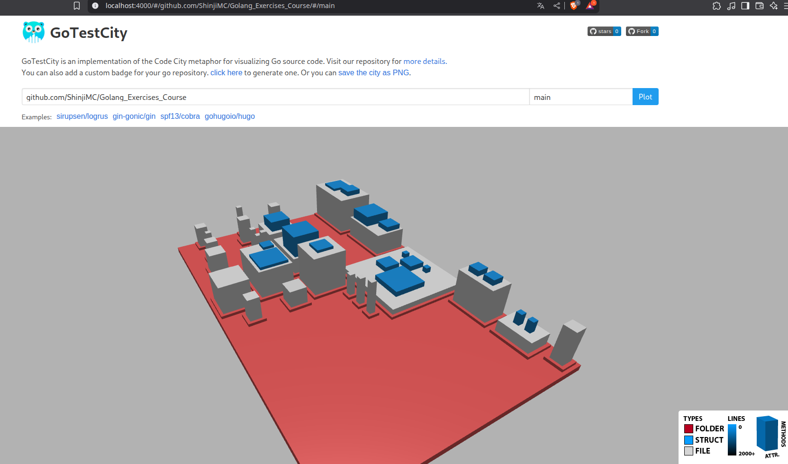

# Go Test City

<a href="https://opensource.org/licenses/MIT">

</a>

---

Go Test City is an extension of GoCity, which implements the Code City metaphor for visualizing source code. GoCity represents a Go program as a city, using the following concepts:

- Folders are districts
- Files are buildings
- Structs are represented as buildings placed on top of their corresponding files

## Structure Characteristics

- The number of lines of code (LOC) determines the building color (higher values result in darker buildings)
- The number of variables (NOV) affects the building’s base size
- The number of methods (NOM) influences the building height

Sure, here is a clean and professional version in English without emojis or symbols:

---

## Run the Backend

To start the backend server:

```bash
cd backend
go run main.go server
```

The server will be available at:

```
http://localhost:4000
```

Make sure that port 4000 is not being used by another process.



export NODE_OPTIONS=--openssl-legacy-provider
yarn start

## Author

- **ShinjiMC** - [GitHub Profile](https://github.com/ShinjiMC)

## License

This project is licensed under the MIT License. See the [LICENSE](LICENSE) file for details.
