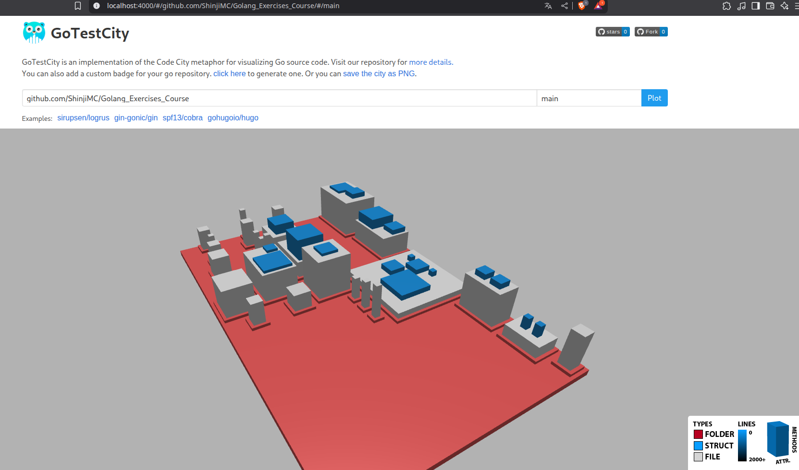

# Go Test City

<a href="https://opensource.org/licenses/MIT">

</a>

---

Go Test City is an extension of GoCity, which implements the Code City metaphor for visualizing source code. GoCity represents a Go program as a city, using the following concepts:

- Folders are districts
- Files are buildings
- Structs are represented as buildings placed on top of their corresponding files

## Structure Characteristics

- The number of lines of code (LOC) determines the building color (higher values result in darker buildings)
- The number of variables (NOV) affects the building’s base size
- The number of methods (NOM) influences the building height

Sure, here is a clean and professional version in English without emojis or symbols:

---

## Run the Backend

To start the backend server:

```bash
cd backend
go run main.go server
```

The server will be available at:

```
http://localhost:4000
```

Make sure that port 4000 is not being used by another process.



export NODE_OPTIONS=--openssl-legacy-provider
yarn start

## Author

- **ShinjiMC** - [GitHub Profile](https://github.com/ShinjiMC)

## License

This project is licensed under the MIT License. See the [LICENSE](LICENSE) file for details.

| Métrica         | Herramienta Go (ejemplos)                                                     |
| --------------- | ----------------------------------------------------------------------------- |
| **Complejidad** | [`gocyclo`](https://github.com/fzipp/gocyclo) (mide complejidad ciclomática). |
| **Cobertura**   | `go-acc` + `gocov` (mide la cobertura del código y lo convierte a JSON).      |
| **Calidad**     | `golangci-lint` (muchos linters: estilo, errores potenciales).                |
| **Seguridad**   | [`gosec`](https://github.com/securego/gosec) (detecta patrones inseguros).    |
| **Duplicidad**  | [`dupl`](https://github.com/mibk/dupl) (detecta código duplicado).            |

go install github.com/ory/go-acc@latest
go install github.com/axw/gocov/gocov@latest
go install github.com/fzipp/gocyclo/cmd/gocyclo@latest
go install github.com/golangci/golangci-lint/cmd/golangci-lint@latest

 curl -sSfL https://raw.githubusercontent.com/golangci/golangci-lint/master/install.sh | sh -s -- -b $(go env GOPATH)/bin v2.4.0
go install github.com/securego/gosec/v2/cmd/gosec@latest
go install github.com/securego/gosec/v2/cmd/gosec@v2.22.7


go run main.go open /home/shinji/Escritorio/Proyectos/conc --port 4000 --branch main

